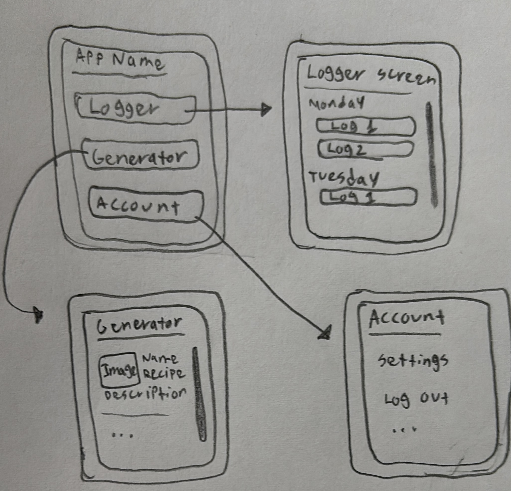
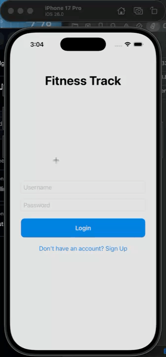
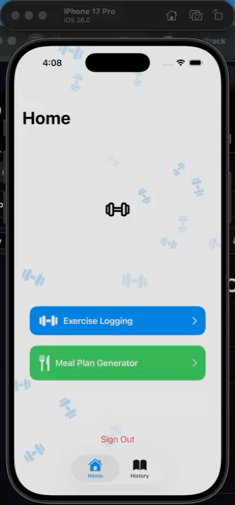

APPLICATION SPECS
===

# Fitness Application

## Table of Contents

1. [Overview](#Overview)
2. [Product Spec](#Product-Spec)
3. [Wireframes](#Wireframes)
4. [Schema](#Schema)

## Overview

### Description

An application that keeps track of fitness goals and actual in-gym exercises. It allows for logging of sets and reps in exercises to monitor your activity. May feature a meal-planner generator.

### App Evaluation

- **Category:** Health / Fitness
- **Mobile:** Mobile is necessary for the easy access to logging of users health journey and exercises. Users use the app to monitor their sets/reps and health journey.
- **Story:**  Helps users stay on top of their exercise progress when working out and allowing for meal planning based on their input information enhancing their fitness journey.
- **Market:** Any gym-going individual upto gym coaches helping keep track of student progress. 
- **Habit:** Gym-goers are using this daily or whenever they are at the gym working out as well as when they need recommendations for meals based on the information they input about themselves.
- **Scope:** V1, one version, is all that is needed as it is for the user themselves and they control what they want to log or what not to log. It is flexible to their choice.

## Product Spec

### 1. User Stories (Required and Optional)

**Required Must-have Stories**
- [x] User Story 1: User can login/signout with backend handled by parseswift and back4app
- [x] User Story 2: User can input set/rep/weight exercise information and it will log.
- [x] User Story 3: User can review log history to view previous work outs and monitor their health journey.
- [ ] User Story 4: User can delete logs if needed based on their specification
- [ ] User Story 5: User can edit logs if a mistake is made upon initial upload.

**Optional Nice-to-have Stories**

- [x] User Story 6 (optional): User can input calories, and other information to use Spoonacular API and return a list of meal-plans for their health journey.

### 2. Screen Archetypes

- [ ] **Information Log Screen**
    * Required User Feature: User can input set/rep information
- [ ] **Log History Screen **
    * Required User Feature: User can delete/edit/view previously uploaded logs.
- [ ] **Meal Plan Input Info Screen**
    * Optional User feature: User can input calories and other information
- [ ] **Meal Plan Generated Screen**
    * Optional User Feature: After Meal Plan Input info, this screen generates the meal plan based on the specifications.

### 3. Navigation

**Tab Navigation** (Tab to Screen)

- [ ] 🏋️ Exercise Logger
- [ ] 📖 Log History
- [ ] 🥗 Meal Plan Generator

**Flow Navigation** (Screen to Screen)

- [ ] **Home Screen**
  * Leads to Information Log Screen
  * Leads to Meal Plan Generator
- [ ] **Information Log Screen**
  * Leads to Log History Screen

## Wireframes

## Schema 

### Models

[User]
| Property | Type   | Description                                  |
|----------|--------|----------------------------------------------|
| username | String | unique id for the user post (default field)   |
| password | String | user's password for login authentication      |
| objectId | String | unique id |
| createdAt | Date | date of account creation |
| updatedAt | Date | in case of update to account |
| emailVerified | boolean | for email verification (optional) |

[ExerciseLog]
| Property | Type   | Description                                  |
|----------|--------|----------------------------------------------|
| objectId | String | unique id for the user post (default field)   |
| createdAt | Date | date of log creation      |
| updatedAt | Date | date of log update |
| workoutName | String | name of user workout |
| sets | Int | number of sets in the workout |
| reps | Int | number of reps in each set |
| weight | Double | lbs used in workout (optional) |
| date | Date | custom date identifier |
| userId | String | to attach correct logs to correct user |

### Networking

- Information Log Screen [POST] /log
- Log History Screen [Get] /logs
- Using Existing API: Meal Plan Generated Screen: [GET] https://api.spoonacular.com/mealplanner/generate

## USER STORY 1: User can login/signout with backend handled by parseswift and back4app

## USER STORY 2 & 3: User can input set/rep/weight exercise information and it will log AND User can review log history to view previous work outs and monitor their health journey.

